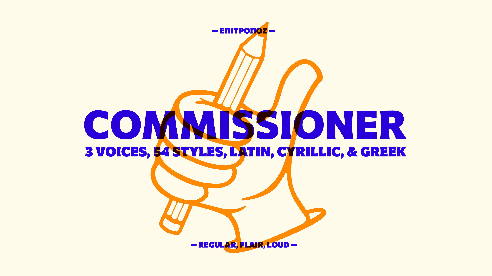

# Commissioner
Commissioner is a variable and static sans typeface designed by Kostas Bartsokas.



## Basic Information
Commissioner is a low-contrast humanist sans-serif with almost classical proportions, conceived as a variable family. The family consists of three “voices”. The default style is a grotesque with straight stems. As the flare axis grows the straight grotesque terminals develop a swelling and become almost glyphic serifs while joints become more idiosyncratic. The volume axis transforms the glyphic serifs to wedge-like ones. 


Each voice of Commissioner comes in a range of styles from Thin to Black including italics. The diverse proportions of lowercase and capitals add warmth and appeal to texts across sizes, while the different voices can express a variation in the typographic texture that ranges from delicate in text sizes to exuberant in larger sizes. 

Commissioner supports the Google Latin Plus, Latin Pro, Cyrillic Plus, Cyrillic Plus .locl, Cyrillic Pro, and Greek Core character sets. The Cyrillic was done with the valuable consultation of Maria Doreuli (maria@contrastfoundry.com).

This typeface project received financial support from Google, and in the future may be available in Google Fonts.


**Variable Axes**

Commisioner has the following axes:

- Weight (wght) - 100 to 900. (Default 100) Controls the darkness of the composed text. Thin, UltraLight, ExtraBold, and Black are ideally used for display sizes, while Light, Regular, Medium, Semibold, Bold can be used for both display and text sizes.

- Slant (slnt) - 0 to -12 degrees. (Default 0) Controls the slant of the letters. A stronger slant creates more emphasis and contrast to upright styles. 

- Flare (FLAR) (also Flair prior to v1.000 Google Fonts release) - 0 to 100. (Default 0) The values are arbitrary and the length of the axis could be narrower (i.e. 0 to 10). As the flare axis grows the straight grotesque terminals develop a swelling and joints become more idiosyncratic. The flare axis refers to the flaring of the stems, but in an earlier version I named it flair, as in stylisness and panache. 

- Volume (VOLM) - 0 to 100. (Default 0) The values are arbitrary and the length of the axis could be narrower (i.e. 0 to 10). The volume axis works only in combination with the Flair axis. It transforms the glyphic serifs to wedge-like ones and add a little more edge to details.  

**Language Support**
<details>
<summary>Expand</summary>
<p>
Latin: Abenaki, Afaan Oromo, Afar, Afrikaans, Albanian, Alsatian, Amis, Anuta, Aragonese, Aranese, Aromanian, Arrernte, Arvanitic, Asturian, Atayal, Aymara, Azerbaijani, Bashkir, Basque, Belarusian, Bemba, Bikol, Bislama, Bosnian, Breton, Cape Verdean, Catalan, Cebuano, Chamorro, Chavacano, Chichewa, Chickasaw, Cimbrian, Cofan, Cornish, Corsican, Creek, Crimean Tatar, Croatian, Czech, Danish, Dawan, Delaware, Dholuo, Drehu, Dutch, English, Esperanto, Estonian, Faroese, Fijian, Filipino, Finnish, Folkspraak, French, Frisian, Friulian, Gagauz, Galician, Ganda, Genoese, German, Gikuyu, Gooniyandi, Greenlandic, Greenlandic Old Orthography, Guadeloupean, Gwichin, Haitian Creole, Han, Hawaiian, Hiligaynon, Hopi, Hotcak, Hungarian, Icelandic, Ido, Igbo, Ilocano, Indonesian, Interglossa, Interlingua, Irish, Istroromanian, Italian, Jamaican, Javanese, Jerriais, Kaingang, Kala Lagaw Ya, Kapampangan, Kaqchikel, Karakalpak, Karelian, Kashubian, Kikongo, Kinyarwanda, Kiribati, Kirundi, Klingon, Kurdish, Ladin, Latin, Latino Sine, Latvian, Lithuanian, Lojban, Lombard, Low Saxon, Luxembourgish, Maasai, Makhuwa, Malay, Maltese, Manx, Maori, Marquesan, Meglenoromanian, Meriam Mir, Mirandese, Mohawk, Moldovan, Montagnais, Montenegrin, Murrinhpatha, Nagamese Creole, Nahuatl, Ndebele, Neapolitan, Ngiyambaa, Niuean, Noongar, Norwegian, Novial, Occidental, Occitan, Old Icelandic, Old Norse, Oshiwambo, Ossetian, Palauan, Papiamento, Piedmontese, Polish, Portuguese, Potawatomi, Qeqchi, Quechua, Rarotongan, Romanian, Romansh, Rotokas, Sami Inari, Sami Lule, Sami Northern, Sami Southern, Samoan, Sango, Saramaccan, Sardinian, Scottish Gaelic, Serbian, Seri, Seychellois, Shawnee, Shona, Sicilian, Silesian, Slovak, Slovenian, Slovio, Somali, Sorbian Lower, Sorbian Upper, Sotho Northern, Sotho Southern, Spanish, Sranan, Sundanese, Swahili, Swazi, Swedish, Tagalog, Tahitian, Tetum, Tok Pisin, Tokelauan, Tongan, Tshiluba, Tsonga, Tswana, Tumbuka, Turkish, Turkmen, Tuvaluan, Tzotzil, Ukrainian, Uzbek, Venetian, Vepsian, Vietnamese, Volapuk, Voro, Wallisian, Walloon, Waraywaray, Warlpiri, Wayuu, Welsh, Wikmungkan, Wiradjuri, Wolof, Xavante, Xhosa, Yapese, Yindjibarndi, Zapotec, Zazaki, Zulu, Zuni
<p>
Cyrillic: Abaza, Abkhaz, Adyghe, Agul, Akhvakh, Altay, Andi, Archi, Avar, Azerbaijani (Cyrillic), Bagvalal Balkar, Bashkir, Belarusian (Cyrillic), Bosnian (Cyrillic), Botlikh, Budukh, Bulgarian, Buryat, Chamalal, Chechen, Chukchi, Chuvash, Crimean Tatar (Cyrillic), Croatian (Cyrillic), Dargwa/Dargin, Dungan, Enets, Erzya, Eskimo, Even, Evenki, Gagauz (Cyrillic), Godoberi, Hinukh, Hunzib, Ingush, Itelmen, Juhuri/çuhuri (Cyrillic), Kabardian, Kalmyk, Karachay, Karaim (Cyrillic), Karakalpak (Cyrillic), Karata, Kazakh, Ket (Cyrillic), Khakas (Cyrillic), Khanty, Khinalugh, Kildin Sami, Komi, Koryak, Krymchak, Kryts, Kubachi, Kumyk, Kurdish (Cyrillic), Kurdish (Cyrillic), Kyrgyz (Cyrillic), Lak, Lezgian, Lingua Franca Nova (Cyrillic), Macedonian, Mansi, Mari (Hill and Meadow), Moksha, Moldovan (Cyrillic), Mongolian (Cyrillic), Montenigrin (Cyrillic), Nanai, Nenets, Nganasan, Nogai, Oroch, Orok, Ossetian, Russian, Rusyn, Rutul, Sakha/Yakut, Serbian (Cyrillic), Shor, Slovio, Tabassaran, Tajik, Talysh (Cyrillic), Tat, Tatar, Tati, Tindi, Tofa, Tsakhur (Cyrillic), Tsez, Turkmen, Tuvan/Tuvinian, Udi, Udmurt, Ukrainian, Ulch, Urum, Uyghur (Cyrillic), Uzbek (Cyrillic), Votik (Cyrillic), Wakhi (Cyrillic), West Polesian, Yaghnobi (Cyrillic), Yukaghir (Northern and Southern), Yukaghir, Yupik.
<p>
Greek: Monotonic Modern Greek.
<p>
</details>  

## Building the fonts

### Step 1: Install Requirements

Set up a virtual environment in the root directory:

```
virtualenv -p python3 venv
```

Activate the virtual environment with:

```
source venv/bin/activate
```

Install requirements with:

```
pip install -U -r requirements.txt
```

### Step 2: Build the fonts

**Building the fonts**

The configuration file for building the fonts is in the `/sources/` folder.

```
cd sources
gftools builder config.yml
```

If you want to export only the variable font, or only the webfonts etc. Open the `config.yml` and change `true`to `false` according to what you want.

This is the current configuration, it builds all formats:

```
buildOTF: true
buildTTF: true
buildVariable: true
buildWebfont: true
```

Following this scheme, you would only build the variable font:

```
buildOTF: false
buildTTF: false
buildVariable: true
buildWebfont: false
```

**Weight Class Fix**

The usWeightClass for Thin and ExtraLight are set to 100 and 200 consecutively. There is a debate on whether these values cause the fonts to get blurred on certain versions of Windows. (https://github.com/googlefonts/fontbakery/issues/2364) 

If you want to change them to 250 and 275 copy the script `sources/fix_usWeightClass.py` to your fonts directory and run it as follows.

```
cd fonts/otf 
python fix_usWeightClass.py
```

## ChangeLog

This is version 1.011. It introduces Tabular Figures and Math symbols, Arrows, missing KaiSymbol, and a fix in the Greek OT Features. 

## License

Commissioner is licensed under the SIL Open Font License v1.1 (<http://scripts.sil.org/OFL>).

To view the copyright and specific terms and conditions please refer to [OFL.txt](https://github.com/kosbarts/Commissioner/blob/master/OFL.txt)
